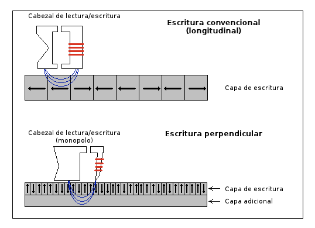
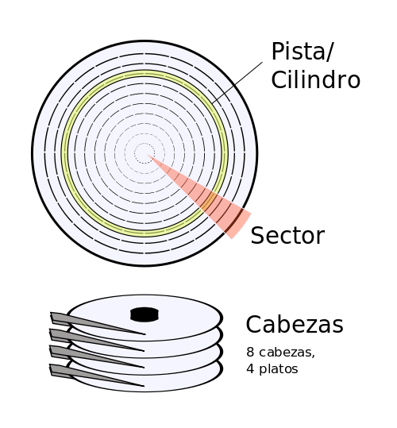
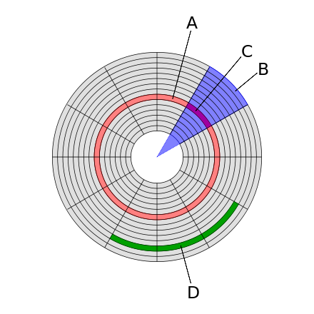

# TEMA 3

## Vocabulario Técnico

**Acceso Aleatorio:** Método que permite la recuperación directa de datos sin costo adicional por posición. Analogía: seleccionar una manzana específica de un cajón.

**Acceso Secuencial:** Proceso donde un grupo de elementos se accede en un orden predeterminado, uno detrás de otro. Analogía: avanzar una película para encontrar un fotograma específico.

**Buffer:** Ubicación de la memoria en un disco, reservada para el almacenamiento temporal de información digital mientras espera ser procesada.

**Cifrar:** Hacer ininteligibles a intrusos (lectores no autorizados) los mensajes o ficheros. Nota: Aunque se confunde con "encriptar," se prefiere el uso de "cifrar."

**Policarbonato:** Grupo de termoplásticos fácil de trabajar y moldear, utilizado ampliamente en la fabricación de CD y DVD.

**Pulgada:** Medida equivalente a 2.54 cm.

**RPM (Revoluciones Por Minuto):** Unidad de frecuencia que representa la velocidad de rotación, comúnmente utilizada para discos duros y ventiladores.

**Desfragmentación:** Proceso para organizar los archivos de un disco, asegurando que cada uno quede en un área continua y no haya espacios sin usar entre ellos. Nota: Práctica común en sistemas Windows.

## Almacenamiento Magnético

El almacenamiento magnético es una técnica que implica la aplicación de campos magnéticos a materiales específicos que pueden reaccionar ante esta influencia y orientarse en posiciones particulares, manteniendo esta orientación incluso después de que se haya dejado de aplicar el campo magnético. Ejemplos comunes de dispositivos de almacenamiento magnético incluyen discos duros y cintas magnéticas. En este método, la información se codifica mediante la variación de la orientación magnética de las partículas en el material de almacenamiento, permitiendo así la lectura y escritura de datos de manera eficiente.

### Disco Duro Magnético

Un disco duro (Hard Disk Drive, HDD) es un dispositivo de almacenamiento de datos no volátil que utiliza un sistema de grabación magnética para almacenar datos digitales. Consiste en uno o más platos o discos rígidos, unidos por un eje común que gira a gran velocidad dentro de una caja metálica sellada no herméticamente. Cada plato tiene cabezales de lectura/escritura que flotan sobre una delgada lámina de aire generada por la rotación de los discos.

#### Tecnología

La grabación perpendicular permite mayores densidades de almacenamiento al alinear los polos de los elementos magnéticos perpendicularmente a la superficie del disco de grabación, como se muestra en el dibujo. Esto ocupa menos espacio que la alineación longitudinal, lo que permite agrupar más elementos magnéticos en una área dada.

El principal desafío al diseñar medios de almacenamiento magnéticos es mantener la magnetización del medio a pesar de las fluctuaciones térmicas. Si la energía térmica disponible es demasiado alta en un punto determinado, habrá energía suficiente para eliminar esta magnetización, con lo que la información almacenada en dicho punto se perderá. Ya que la energía necesaria para eliminar la magnetización de una determinada región magnética es proporcional al tamaño de dicha región (cuanto mayor sea más estable y por tanto más inmune a la temperatura), hay un tamaño mínimo para estas regiones magnéticas a una determinada temperatura. Si el tamaño cae por debajo de este mínimo, la región podría ser desmagnetizada en cualquier momento por esta energía térmica disponible. La grabación perpendicular ayuda a mantener el mismo tamaño de región magnética que en el estándar, pero organiza las regiones magnéticas de manera más eficiente.

Generalmente, los discos duros deben trabajar desde los 37 oC hasta los 46 oC; a temperaturas fuera de este rango, se va degradando el disco; hasta los 20oC o a partir de 60 oC la información se pierde (habría que consultarlo en la ficha técnica del fabricante del disco). Para un uso intensivo del disco (clonaciones, usos empresariales, copias de seguridad, etc) se debería refrigerar según un estudio en Google

Otras consideraciones a tener en cuenta para su durabilidad es el nivelado del disco y evitar las vibraciones.

#### Estructura física

Dentro de un disco duro, se encuentran uno o varios discos concéntricos, fabricados en aluminio o cristal, conocidos como platos (habitualmente entre 2 y 4). Estos platos giran simultáneamente sobre un eje central al que están unidos. Un componente crucial es el conjunto de brazos dispuestos en forma de peine, alineados verticalmente, y que se desplazan de manera sincronizada. En la punta de cada brazo se sitúa una cabeza de lectura/escritura. En términos generales, existe una cabeza de lectura/escritura por cada superficie de cada plato.

El movimiento de los cabezales puede dirigirse hacia el interior o el exterior de los platos. Esta capacidad, combinada con la rotación de los platos, posibilita que las cabezas de lectura/escritura alcancen cualquier posición en la superficie de estos discos, permitiendo así un acceso eficiente a los datos almacenados.

Es esencial contar con una cabeza de lectura/escritura para cada cara de los platos. En el diagrama que tienes a continuación, se aprecian inicialmente 4 brazos, uno por cada plato. Cada brazo está equipado con 2 cabezas: una destinada a leer la cara superior del plato y otra para la cara inferior. Por lo tanto, hay un total de 8 cabezas para la lectura de los 4 platos.

Un aspecto crucial es que las cabezas de lectura/escritura nunca entran en contacto directo con los discos. En lugar de ello, pasan muy cerca (hasta a 3 nanómetros), gracias a una película de aire extremadamente delgada generada por el giro de los platos. Si alguna de las cabezas llegara a tocar la superficie de un plato, podría ocasionar daños significativos, rayándolo gravemente. Esto se debe a la alta velocidad de rotación de los platos; por ejemplo, un disco que gira a 7,200 revoluciones por minuto se desplaza a una velocidad de 129 km/h.

#### Organización de Direccionamiento en Discos Duros

En el contexto del disco duro, diversos términos se utilizan para referirse a diferentes áreas del dispositivo:

- **Plato:** Cada uno de los discos físicos presentes dentro de la unidad de disco duro.

- **Cara:** Cada uno de los dos lados disponibles en un plato, donde cada lado puede contener información independiente.

- **Cabeza:** Se refiere al número de cabezales de lectura/escritura presentes en la unidad. Cada cabeza está asociada a una cara específica.

- **Pistas:** Círculos concéntricos dentro de una cara, siendo la pista 0 la más externa en el borde.

- **Cilindro:** Un conjunto vertical de pistas, formado por todas las pistas alineadas en diferentes caras.

- **Sector:** Cada una de las divisiones individuales de una pista, siendo todas del mismo tamaño. El estándar actual establece un tamaño de 4096 bytes por sector.

- **Clúster:** Una agrupación contigua de sectores en un disco, utilizada comúnmente como unidad de asignación para la gestión de archivos.

- **Sector geométrico:** Una agrupación de sectores provenientes de pistas adyacentes, visualizable como una porción en un plato similar a una pizza.

El método de direccionamiento LBA (Logical Block Addressing) consiste en dividir el disco en sectores y asignar a cada uno un número único. Este enfoque de direccionamiento se encuentra actualmente en uso.

Las velocidades de lectura y escritura pueden variar considerablemente entre diferentes modelos y marcas de unidades de estado sólido (SSD) y discos duros (HDD). 

**SSD:**
- Velocidad de lectura: Las SSD pueden ofrecer velocidades de lectura secuencial que van desde aproximadamente 300 MB/s hasta más de 3,500 MB/s, dependiendo del modelo.
- Velocidad de escritura: Las velocidades de escritura secuencial de las SSD suelen estar en el rango de 200 MB/s a más de 3,000 MB/s.

**HDD:**
- Velocidad de lectura y escritura: Las HDD tradicionales tienen velocidades de lectura y escritura secuenciales más lentas en comparación con las SSD. Las velocidades típicas para una HDD suelen estar en el rango de 80 MB/s a 160 MB/s o incluso más, dependiendo de factores como la velocidad de rotación (rpm) y la densidad de datos.

Es importante destacar que las SSD son generalmente más rápidas y ofrecen un rendimiento más ágil en comparación con los discos duros tradicionales, especialmente en términos de acceso aleatorio y velocidades de lectura/escritura de pequeños archivos. La elección entre un SSD y un HDD dependerá de tus necesidades específicas de almacenamiento y rendimiento.